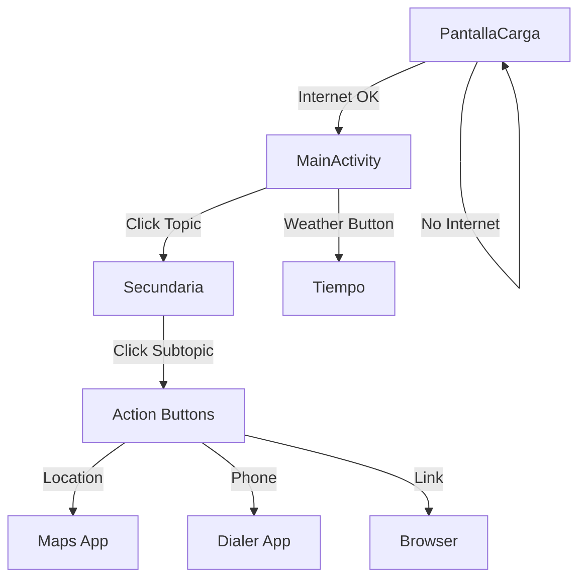

## Application Architecture

HuelvaPedia is built using a traditional Android architecture with Firebase as the backend. The app follows a simple but effective three-tier architecture:

1. **Presentation Layer** - Activities and UI components
2. **Data Layer** - Firebase Realtime Database integration
3. **Adapter Layer** - RecyclerView adapters for list presentation

## Core Components

### Package Structure

The application code is organized under `com.example.huelvapedia`:

```
com.example.huelvapedia/
├── PantallaCarga.java          # Splash screen with connectivity check
├── MainActivity.java            # Main screen displaying primary topics
├── Secundaria.java              # Secondary screen for subtopics
├── Elementos.java               # Data model class
├── Adaptador.java               # RecyclerView adapter
└── ApiTiempo/
    └── Tiempo.java              # Weather activity using OpenWeatherMap API
```

## Data Flow

<Steps>
  <Step title="Firebase Connection">
    The app establishes a connection to Firebase Realtime Database using `DatabaseReference`.
    
    ```java
    reference = FirebaseDatabase.getInstance().getReference().child("principal");
    ```
  </Step>
  
  <Step title="Data Retrieval">
    A `ValueEventListener` listens for data changes and retrieves `Elementos` objects.
    
    ```java
    reference.addValueEventListener(new ValueEventListener() {
        @Override
        public void onDataChange(@NonNull DataSnapshot snapshot) {
            listaElementos.clear();
            for (DataSnapshot dataSnapshot : snapshot.getChildren()) {
                Elementos elemento = dataSnapshot.getValue(Elementos.class);
                listaElementos.add(elemento);
            }
            adaptador = new Adaptador(MainActivity.this, listaElementos);
            recyclerView.setAdapter(adaptador);
        }
    });
    ```
  </Step>
  
  <Step title="Adapter Binding">
    The `Adaptador` class binds data to RecyclerView items and handles user interactions.
  </Step>
  
  <Step title="UI Rendering">
    RecyclerView displays the list items with images loaded via Picasso library.
  </Step>
</Steps>

## RecyclerView Pattern

The app uses RecyclerView extensively for displaying lists of topics and subtopics:

- **LinearLayoutManager** - Items are displayed in a vertical list
- **Custom Adapter** - `Adaptador` class extends `RecyclerView.Adapter<MiViewHolder>`
- **ViewHolder Pattern** - `MiViewHolder` holds references to item views for efficient recycling

### RecyclerView Setup

```java
recyclerView = findViewById(R.id.recicler);
recyclerView.setLayoutManager(new LinearLayoutManager(this));

listaElementos = new ArrayList<>();
adaptador = new Adaptador(MainActivity.this, listaElementos);
recyclerView.setAdapter(adaptador);
```

## Component Relationships

<CardGroup cols={2}>
  <Card title="PantallaCarga" icon="spinner">
    Entry point that checks internet connectivity before navigating to MainActivity
  </Card>
  
  <Card title="MainActivity" icon="home">
    Displays primary topics from Firebase's "principal" node
  </Card>
  
  <Card title="Secundaria" icon="list">
    Displays subtopics based on selected category from MainActivity
  </Card>
  
  <Card title="Tiempo" icon="cloud-sun">
    Standalone weather screen using OpenWeatherMap API
  </Card>
</CardGroup>

## Navigation Flow



## Key Design Patterns

<AccordionGroup>
  <Accordion title="ViewHolder Pattern">
    Used in `Adaptador.MiViewHolder` to cache view references and improve RecyclerView performance.
    
    ```java
    static class MiViewHolder extends RecyclerView.ViewHolder {
        TextView nombre, descripcion;
        ImageView imagen;
        Button botonUbicacion, botonLlamar, botonEnlace;
    }
    ```
  </Accordion>
  
  <Accordion title="Observer Pattern">
    Firebase `ValueEventListener` observes database changes and automatically updates the UI.
  </Accordion>
  
  <Accordion title="Adapter Pattern">
    `Adaptador` class adapts data from `ArrayList<Elementos>` to RecyclerView presentation.
  </Accordion>
</AccordionGroup>

## External Dependencies

- **Firebase Realtime Database** - Cloud-hosted NoSQL database for storing topics and content
- **Picasso** - Image loading and caching library
- **Volley** - HTTP library for weather API requests
- **OpenWeatherMap API** - Provides weather data for Huelva

<Note>
The app requires an active internet connection to function, as all content is loaded from Firebase in real-time.
</Note>
